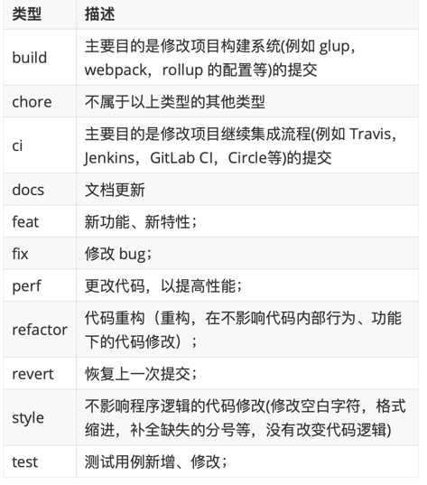

# 规范化处理

解决的问题：
1. 代码质量问题：使用方式有可能有问题
2. 代码风格问题：风格不符合一定规则

## eslint
### 相关包
```JSON
{
  "@typescript-eslint/eslint-plugin": "^5.4.0",// ts语法的配置；
  "@typescript-eslint/parser": "^5.4.0",// 是 TS 迁移到 ESLint 之后给出的标准方案。
  // @typescript-eslint/parser 是 一个 ESLint 解析器，它可以将 TS 源代码解析为 TypeScript ESTree，然后在 TypeScript ESTree 之上构建规则。
  "@vue/eslint-config-standard": "^6.1.0",
  // JavaScript标准样式的ESLint可配置，基础配置；
  "@vue/eslint-config-typescript": "^9.1.0",
  // 此配置专为@vue/cli& create-vuesetups 使用而设计，不适合外部使用
  "eslint": "^8.23.0",
  "eslint-plugin-import": "^2.25.3", 
  // 针对impot语法优化的插件，防止webpack自定义路径造成的错误
  "eslint-plugin-node": "^11.1.0",
  // 为node准备的eslint规则配置
  "eslint-plugin-promise": "^5.1.0",
  // es语法promise的eslint最佳配置；
  "eslint-plugin-vue": "^8.0.3"
  // vue项目的的配置，vue项目必须；
}
```


## prettier

```
npm i prettier eslint-config-prettier eslint-plugin-prettier -D
```
### eslint-config-prettier
eslint-config-prettier 来关掉 (disable) 所有和 Prettier 冲突的 ESLint 的配置
方法就是在 .eslintrc 里面将 prettier 设为最后一个 extends
```
// .eslintrc    
{      
    "extends": ["prettier"] // prettier 一定要是最后一个，才能确保覆盖    
}
```
### eslint-plugin-prettier
将 prettier 的 rules 以插件的形式加入到 ESLint 里面，相当于把 Prettier 推荐的格式问题的配置以 ESLint rules 的方式写入，这样相当于可以统一代码问题的来源。
```
// .eslintrc    
{      
    "plugins": ["prettier"],      
    "rules": {        
        "prettier/prettier": "error"      
    }    
}
```
### 合并
将上面两个步骤和在一起就是下面的配置，也是官方的推荐配置
```
// .eslintrc
{
  "extends": ["plugin:prettier/recommended"]
}
```

## 配置script命令
```JSON
{
  "scripts": {
    "lint": "vue-cli-service lint --fix --ext .js,.ts,.tsx,.vue,./src --quiet",
    "format": "prettier .  --write"
  }
}
```
执行 pnpm run lint 修复eslint 报错
执行 pnpm run format 修复prettier 报错

## husky
husky是一个让配置git钩子变得更简单的工具，支持所有的git钩子。它可以将git内置的钩子暴露出来，很方便地进行钩子命令注入，而不需要在.git/hooks目录下自己写shell脚本了。您可以使用它来lint您的提交消息、运行测试、lint代码等。当你commit或push的时候。husky触发所有git钩子脚本。

安装husky,
启用husky，启用后，根目录会出现一个.husky的文件夹
编辑package.json文件，在scripts中添加"prepare": "husky install"命令
```
npm install husky --save -D
npx husky install
```
在.husky文件夹中，新建pre-commit文件
```
#!/bin/sh
. "$(dirname "$0")/_/husky.sh"

npx lint-staged --allow-empty
```
安装lint-staged，这是本地暂存代码的检查工具，当你git提交代码时，会自动检查是否符合项目eslint和prettier规范
```
npm install lint-staged --save -D
```

在项目根目录创建.lintstagedrc.json文件，写入以下代码：
```
{
"*.{ts,js,vue,tsx,jsx}": ["npm run lint-fix", "prettier --write"]
}
```
git提交的时候，会自动根据项目eslint和prettier规范修复代码并提交，如果碰到修复不了的，会取消提交。

## 配置commitlint
在git提交时，如果能找按照规范写好提交信息，能提高可读性以及项目维护效率，方便回溯。这里我们使用commitlint规范git commit提交的信息。

### 代码提交检测
```
pnpm install @commitlint/cli @commitlint/config-
conventional -D
npx husky add .husky/commit-msg "npx --no-install commitlint --edit $1"
```

### commitlint.config.js配置
```js
module.exports = {
    extends: ["@commitlint/config-conventional"]
}
```
> git commit -m"feat: 初始化工程"


 